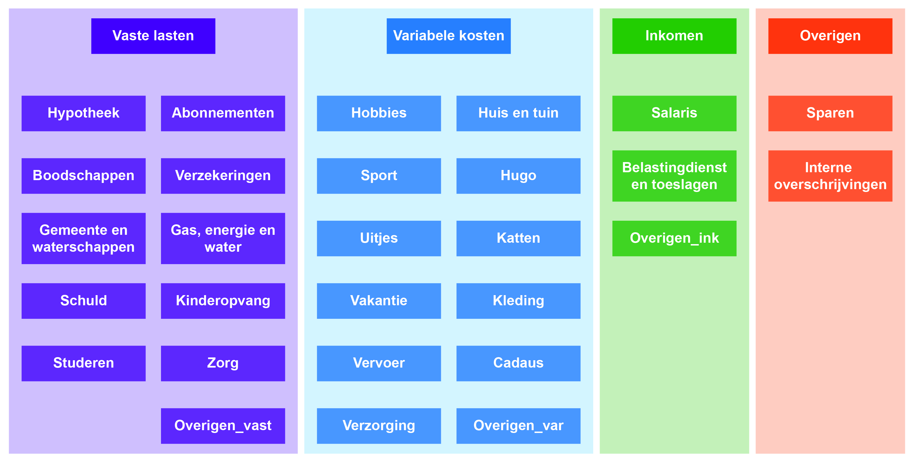

```{r setup, include=FALSE}
knitr::opts_chunk$set(echo = TRUE)
```

# Financiën `r lubridate::year(Sys.Date())` - `r lubridate::year(Sys.Date())`

##
```{r dependencies, message=FALSE}
library(renv)
library(readr)
library(tidyverse)
library(lubridate)
library(magrittr)

source("unify input read in.R")
source("functions.R")
```

``` {r input}
# Read in files
bt <- rbind(suppressMessages(ReadBT("Input/Banktrans_tm_02022020.csv")) %>% mutate("Bron" = "BT"),
            ReadING("Input/NL39INGB0006347095_01-02-2020_03-04-2022.csv") %>% mutate("Bron" = "Cenna"),
            ReadING("Input/NL22INGB0798255498_23-02-2020_03-04-2022.csv") %>% mutate("Bron" = "Gezamenlijk"),
            ReadABNA("Input/220404213522_04112020_04042022.TAB") %>% mutate("Bron" = "Thijs"))
```

##
De data is verdeeld in de volgende categorieën:




``` {r categories}
# Assign categories
formals(grepl)$ignore.case <- TRUE
bt %<>%
  unite("All", Naam:Tag, remove = FALSE) %>%
  mutate("Subcategorie" = as.factor(case_when(.default = "",
            
            # Vaste lasten
            grepl("FLORIUS|CAPREIT|hypotheek", All) ~ "Hypotheek",
            grepl("KPN|Netflix|SPOTIFY|Disney|TELE2|Amazon|Feenstra|Boekenplezier", All) ~ "Abonnementen",
            grepl("AH |Albert|Heijn|Jumbo|Noten|Coop|Aldi|Lidl|Poelier|Koopman|HelloFresh|
                  |Makro Duiven D|Slagerij|Bakker|Snackbar|Domino|Pizza|Takeaway|SiteDish|Spare Rib|Spar|
                  |Oliebollen|Refter|Catering|Molen|boodschappen", All) ~ "Boodschappen",
            grepl("SCHADEV|FBTO|OHRA|UNIGARANT|Unive|verzeker", All) ~ "Verzekering",
            grepl("GBLT|gemeente|Aanbiedstation", All) ~ "Gemeente en waterschappen",
            grepl("Vitens|Vattenfall|Nuon|Alliander", All) ~ "Gas, energie en water",
            grepl("Dienst Uitvoering Onderwijs|DUO", All) ~ "Schuld",
            grepl("ZONNEKINDEREN", All) ~ "Kinderopvang",
            grepl("SKU IZ RU", All) ~ "Studeren",
            grepl("apotheek|medics|Rijnstate|uwnota", All) ~ "Zorg",
            grepl("OranjePakket|BasisPakket|rekeninghouder", All) ~ "Overigen_vast",
            
            # Variabele kosten
            grepl("Steam|steam|GlobalCollect|Azerty|Alternate|Media markt|Google|ski", All) ~ "Hobbies",
            grepl("Groenrijk|IKEA|Blokker|verhuizen|Huis |Praxis|Gamma|Hornbach|Coolblue|
                  |Karwei|Droge notariaat|Miele|verf", All) ~ "Huis en tuin",
            grepl("Yogapraktijk|Fitness", All) ~ "Sport",
            grepl("Prenatal|Geboortecentrum|KraamZus|Hugo", All) ~ "Hugo",
            grepl("Uitje|Uiteten|Uit eten|De Markt|Food|Ijssalon|Doner|Huiskamer|Jax|Nos", All) ~ "Uitjes",
            grepl("Bitiba|Katten|Elzen|Petshop", All) ~ "Katten",
            grepl("vakantie", All) ~ "Vakantie",
            grepl("HEMA|Wehkamp|Jeans Centre|MS Mode|Schuurman Schoenen|Primark|Miss Etam|MS 1|HENNES|
                  |Van Haren|Steps|Zeeman|kleding", All) ~ "Kleding",
            grepl("NS Zev|NS Groep|NS Arnhem|NS-|Decathlon|Werk OV|gen OV|\\*OV|TC&O|Fiets|Auto Martens|
                  |Wentholt|Avia|Esso|Shell|Benzine|Parkeer|reis|Wensink", All) ~ "Vervoer",
            grepl("Cadeau|floris|Fleurop|Rebers|gift", All) ~ "Cadeaus",
            grepl("Schoonheidssalon|Huidverbet|Etos|Trekpleister|Kruidvat|kapper|Drogist|Barrett", All) ~ "Verzorging",
            grepl("Radboud.*NIJMEGEN|Julia|Starbucks|kiosk|ING winkel|BK |MCDONALD'S|INTERTOYS|Smullers|
                  |Action|Allekabels|BOL|Easy Wok|GELDMAAT|Cash|Wibra|zevenaar|Nijmegen|Loterij|Cenna|
                  |Thijs|Doedorp|Werkgroep|deco|Philips", All) ~ "Overigen_var",
            
            # Inkomen
            grepl("Radboud|GENETICA|KATHOLIEKE UNI|Werkbezoek|UWV|Nedap|Creditcard|KAMER VAN KOOPHAND", All) ~ "Salaris",
            grepl("Belasting", All) ~ "Belastingdienst en toeslagen",
            grepl("inkomsten|schenk", All) ~ "Overigen_ink",
            grepl("NL35INGB0000163029|NL42INGB0000918824", Tegenrekening)  ~ "Overigen_ink",
            
            # Overigen
            grepl("Sparen", All) ~ "Sparen",
            # grepl("", All) ~ "Interne overschrijvingen",
            grepl("NL80ABNA0625680936|NL39INGB0006347095|NL22INGB0798255498", Tegenrekening) ~ "Interne overschrijvingen")),
         
         "Categorie" = as.factor(case_when(.default = "",
            grepl("Hypotheek|Abonnementen|Boodschappen|Verzekeringen|Gemeente en waterschappen|
                  Gas, energie en water|Schuld|Kinderopvang|Studeren|Zorg|Overigen_vast", Subcategorie) ~ "Vaste lasten",
            grepl("Hobbies|Huis en tuin|Sport|Hugo|Uitjes|Katten|Vakantie|Kleding|Vervoer|
                  Cadeaus|Verzorging|Overigen_var", Subcategorie) ~ "Variabele kosten",
            grepl("Salaris|Belastingdienst en toeslagen|Overigen_ink", Subcategorie) ~ "Inkomen",
            grepl("Sparen|Interne overschrijvingen", Subcategorie) ~ "Overigen"))) %>%
  select(everything(), Categorie, Subcategorie)

bt %>% filter(grepl("deco", All)) -> x
bt %>% filter(Tegenrekening == "NL22INGB0798255498") -> x

# Not categorized
leftovers <- bt %>% filter(Subcategorie == "")
View(leftovers)

leftovers %>% filter(grepl("aanbiedstation", All))
```
### TODO: categorize data

# To correct/ assign:
Incasso Feenstra Verwarming 2100581 = Huis
